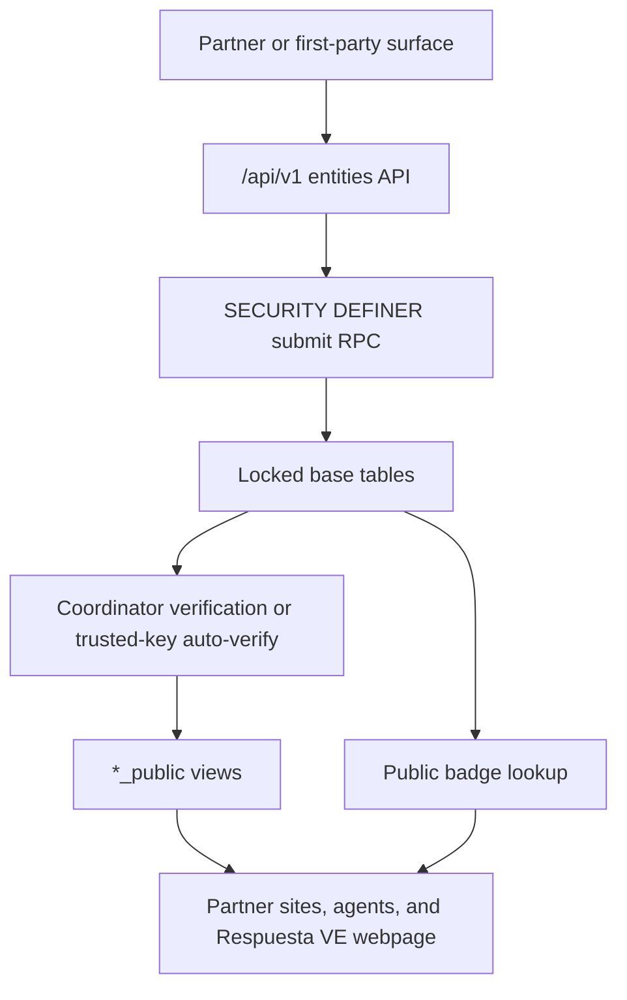
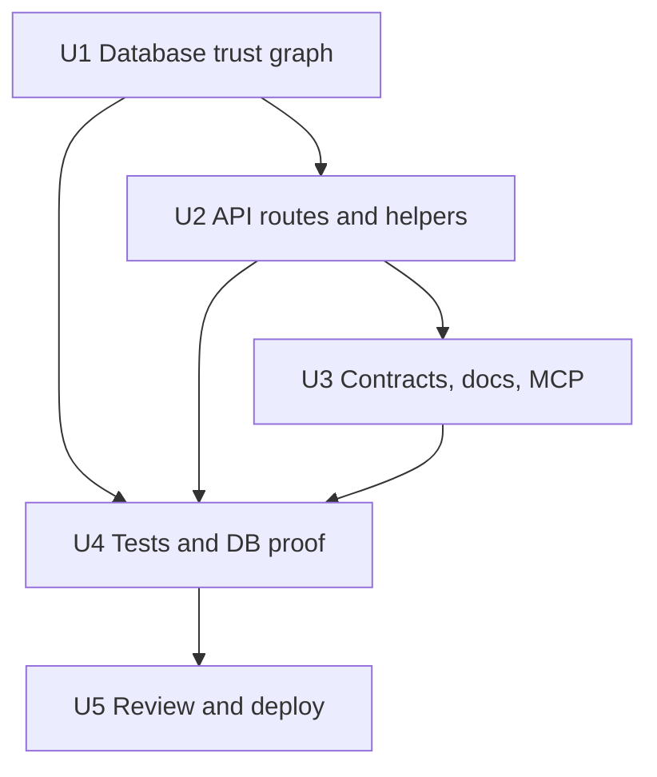
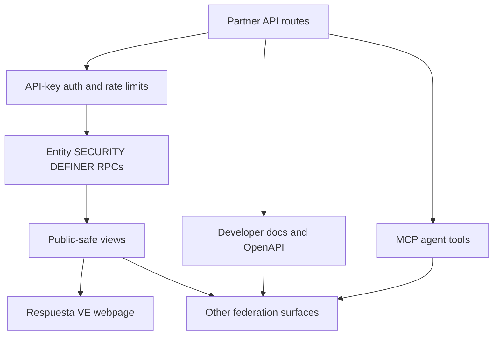

# feat: Add humanitarian federation API trust graph

## Overview

Respuesta VE should become the canonical validating backend, while `respuestave.org`
is only one intake/display surface among many. This plan extends the existing
partner API beyond missing-person deduplication into a public-safe coordination
graph for trusted crisis entities: hospitals, clinics, shelters, supply hubs,
community groups, official channels, current needs, public contribution links,
and verified partner badges.

The first durable slice is deliberately narrow: partners can submit entity data
through the API, the backend validates and gates it, verified projections can be
read and synced by other surfaces, and partner sites can show a public badge
lookup proving that their domain is a verified federation participant.

---

## Problem Frame

The user goal is not just another website. Other sites and agents need a shared
source of truth they can read and write through, so the same hospital, shelter,
org, missing-person status, need, or contribution channel does not fragment into
stale copies across unrelated surfaces. The Venezuelan government is not
providing this coordination layer, so Respuesta VE must provide a conservative,
privacy-preserving federation API with coordinator verification where a wrong
record could misdirect aid or expose vulnerable people.

---

## Requirements Trace

- R1. Surfaces can gather humanitarian records and submit them to Respuesta VE
  through a documented partner API instead of each site becoming its own silo.
- R2. The backend validates submissions, attributes them to coordinator-issued
  partner keys, and gates public exposure through verification or explicit
  trusted-key configuration.
- R3. Public readers can search and incrementally sync verified entity records
  without scraping and without access to base tables or private fields.
- R4. Duplicate and stale data risks are reduced by stable partner
  `externalId` values, source timestamps, link-backs, and stale-update
  protection.
- R5. Missing-person federation remains non-destructive; this entity graph is
  additive and must not introduce automatic person merges.
- R6. Public responses never expose raw private contact fields, precise private
  addresses beyond intentionally public channel text, cédula values, API-key
  hashes, or private moderation notes.
- R7. Partner-facing surfaces can verify a domain badge so readers know a site
  is participating in the shared federation rather than improvising untrusted
  copy.

---

## Scope Boundaries

- This plan does not build a full coordinator UI for editing entities; it adds
  coordinator RPC primitives and public-safe API surfaces.
- This plan does not auto-merge missing people, hospitals, orgs, or shelters
  across sources. The first entity idempotency key is per partner key plus
  external id.
- This plan does not expose payment-account verification, private donation
  routing, precise private coordinates, reporter contact, or base-table reads.
- This plan does not replace the existing missing-person API; it extends the
  same partner API contract with entity federation.

### Deferred to Follow-Up Work

- Cross-partner entity dedup/merge review UI: future coordinator workflow after
  enough entity submissions exist to justify reversible merge tooling.
- Web intake forms that submit entities through first-party server routes:
  future product work after the backend contract is live.
- Rich trust scoring and evidence provenance: future moderation work; this slice
  uses coordinator-set partner trust and verification status only.

---

## Context & Research

### Relevant Code and Patterns

- `lib/api/auth.ts` provides API-key extraction, hash verification, rate-limit
  envelopes, and `apiOk` / `apiError` response helpers.
- `app/api/v1/persons/route.ts`, `app/api/v1/persons/status/route.ts`, and
  `app/api/v1/persons/changes/route.ts` are the route-handler patterns for
  partner auth, source ownership, stale status reconciliation, and sync cursors.
- `lib/api/schemas.ts` is the existing Zod validation boundary for partner
  request bodies and query strings.
- `lib/api/matching.ts` and `lib/api/redact.ts` keep public reads behind
  redacted public projections instead of base tables.
- `supabase/migrations/0020_partner_api.sql`,
  `supabase/migrations/0021_api_security_hardening.sql`,
  `supabase/migrations/0026_missing_person_partner_status_sync.sql`, and
  `supabase/migrations/0027_partner_status_rpc_key_check.sql` are the current
  partner API database patterns to mirror.
- `scripts/api/README.md`, `app/desarrolladores/page.tsx`, and `mcp-server/`
  are the partner documentation and agent-accessible surfaces that must stay in
  contract parity with the API.

### Institutional Learnings

- No `docs/solutions/` entries are present in this checkout. The repo-local
  guidance in `AGENTS.md`, `README.md`, `ARCHITECTURE.md`, and `docs/STATUS.md`
  is the grounding source for privacy, API, migration, and deploy behavior.

### External References

- The Next.js 16 route-handler docs under `node_modules/next/dist/docs/` are the
  framework source for API route conventions in this repo.

---

## Key Technical Decisions

- Add a `coordination_entities` graph instead of overloading missing-person
  tables: hospitals, shelters, orgs, and needs have different privacy, lifecycle,
  and verification semantics than people.
- Preserve the existing privilege model: Next.js uses the Supabase anon key,
  authenticated partner routes call `SECURITY DEFINER` RPCs, and public reads
  use `*_public` views.
- Use partner key plus `externalId` as the first idempotency boundary: this
  prevents one partner from overwriting another partner's source record while
  still letting each partner update its own row.
- Make public exposure explicit: non-auto-verified partners land in
  `needs_review`, while coordinator-marked trusted keys can auto-verify entity
  data for faster humanitarian lanes.
- Treat source timestamps as authority for stale protection: older updates must
  not cancel or overwrite newer source state.
- Keep badge verification as a domain lookup backed by coordinator-managed
  `partner_api_keys.verified_domains`, not by caller-supplied claims.

---

## Open Questions

### Resolved During Planning

- Should this first slice try to solve cross-partner entity dedup? No. A wrong
  merge can misroute aid or hide a corrected status. The safe first step is
  per-partner idempotency plus public sync; reversible merge tooling can follow.
- Should entities be publicly visible immediately? Only for coordinator-trusted
  API keys marked for entity auto-verification. All other partner submissions
  remain review-gated.
- Should the webpage be the only intake surface? No. The webpage is one surface;
  the API is the shared contract other surfaces and agents use.

### Deferred to Implementation

- Exact RPC return shapes and SQL validation details should be finalized against
  local type-checks and a rolled-back Supabase proof.
- Exact public page copy should be adjusted only enough to keep partner
  documentation accurate; no landing-page redesign is in scope.

---

## High-Level Technical Design

> *This illustrates the intended approach and is directional guidance for review,
> not implementation specification. The implementing agent should treat it as
> context, not code to reproduce.*

---

## Implementation Units

- [x] U1. **Database trust graph**

**Goal:** Add persistent, public-safe storage for federated coordination
entities, public contribution channels, active needs, and verified partner
badges.

**Requirements:** R1, R2, R3, R4, R6, R7

**Dependencies:** None

**Files:**
- Create: `supabase/migrations/0029_coordination_entity_trust_graph.sql`
- Create: `supabase/migrations/0030_coordination_entity_rpc_validation.sql`
- Create: `supabase/migrations/0031_coordination_entity_rls_initplan.sql`
- Create: `supabase/migrations/0032_coordination_entity_rls_auth_uid_initplan.sql`
- Create: `supabase/migrations/0033_partner_badge_public_shape.sql`
- Test: rolled-back Supabase transaction proof

**Approach:**
- Create additive enums and tables for entity kind, verification status,
  channel type, need category, and need lifecycle.
- Extend `partner_api_keys` with coordinator-managed verified domains, badge
  state, and entity auto-verification flags.
- Keep base tables RLS-locked and expose only public-safe views for verified,
  unexpired data.
- Implement `submit_coordination_entity` as the partner write path with key-hash
  proof, scope checks, source timestamp stale protection, bounded JSON arrays,
  and deterministic replacement of source channels/needs.
- Implement `verify_coordination_entity` as a coordinator-only moderation
  primitive.

**Patterns to follow:**
- `supabase/migrations/0020_partner_api.sql`
- `supabase/migrations/0026_missing_person_partner_status_sync.sql`
- `supabase/migrations/0027_partner_status_rpc_key_check.sql`

**Test scenarios:**
- Happy path: a trusted key submits a hospital with one public channel and one
  open need; public views expose the entity, channel, and need.
- Happy path: a non-auto-verified key submits an entity; the base row exists but
  public views do not expose it until verification.
- Edge case: an older `sourceUpdatedAt` update for an existing `externalId`
  returns `stale_ignored` and leaves current public data unchanged.
- Error path: an invalid key hash, missing `ingest` scope, invalid source URL,
  bad channel URL, or bad JSON array shape returns a structured RPC error.
- Integration: public views omit base-table address, verification notes, key
  hashes, and private partner metadata while still showing fuzzed coordinates.

**Verification:**
- Migration applies cleanly to Supabase.
- Supabase advisors show no new unexpected security findings beyond intentional
  `security_definer_view` and `SECURITY DEFINER` RPC warnings documented by the
  repo.

- [x] U2. **Partner API routes and helper layer**

**Goal:** Expose entity submit/search/sync and badge lookup through the same
authenticated partner API contract as missing-person federation.

**Requirements:** R1, R2, R3, R4, R6, R7

**Dependencies:** U1

**Files:**
- Create: `lib/api/entities.ts`
- Create: `app/api/v1/entities/route.ts`
- Create: `app/api/v1/entities/changes/route.ts`
- Create: `app/api/v1/badge/route.ts`
- Modify: `lib/api/schemas.ts`
- Test: `lib/api/api.test.mjs`

**Approach:**
- Add strict Zod schemas for entity input, channels, needs, entity search, and
  badge domain lookup.
- Call `authenticate(req, 'ingest')` for entity writes and
  `authenticate(req, 'search')` for entity reads/sync.
- Pass the raw API key hash to the entity RPC so direct RPC calls cannot spoof a
  key id.
- Hydrate public entities with public channels and needs from `*_public` views
  only.
- Keep `/badge` public, but validate and normalize the domain before querying
  `partner_badges_public`.

**Patterns to follow:**
- `app/api/v1/persons/route.ts`
- `app/api/v1/persons/changes/route.ts`
- `app/api/v1/persons/status/route.ts`
- `lib/api/matching.ts`

**Test scenarios:**
- Happy path: `CoordinationEntityInput` accepts a hospital with a public URL
  channel and an open need.
- Edge case: `lat` without `lng` is rejected before it reaches Postgres.
- Error path: a channel without `url` or `displayText` is rejected.
- Error path: `EntityUpsertRequest` rejects missing or invalid `sourceUrl`.
- Error path: badge domains with protocols, paths, and `www.` normalize to the
  registrable domain shape; invalid domains return `null`.
- Integration: serialized public entity output contains only the public contract
  fields and no address, key hash, contact, or moderation note fields.

**Verification:**
- Pure API tests pass offline.
- Type-check confirms the route handlers and helper types compile under the
  repo's Next.js 16 setup.

- [x] U3. **Public contract, documentation, and MCP parity**

**Goal:** Make the new federation slice discoverable to developers, humans, and
AI agents.

**Requirements:** R1, R3, R6, R7

**Dependencies:** U2

**Files:**
- Modify: `app/api/v1/route.ts`
- Modify: `app/api/v1/openapi/route.ts`
- Modify: `app/desarrolladores/page.tsx`
- Modify: `scripts/api/README.md`
- Modify: `mcp-server/index.mjs`
- Modify: `mcp-server/README.md`
- Modify: `mcp-server/package.json`

**Approach:**
- Version the partner API discovery/OpenAPI metadata to reflect the broader
  humanitarian federation contract.
- Document entity submit/search/sync and badge lookup alongside existing
  missing-person endpoints.
- Add MCP tools for entity submit/search/sync and badge verification so agentic
  partner workflows can use the same backend instead of scraping.
- Keep the privacy language explicit: entity public data is verified, fuzzed,
  linked back, and limited to public channels/needs.

**Patterns to follow:**
- Existing OpenAPI object style in `app/api/v1/openapi/route.ts`
- Existing MCP tool registration style in `mcp-server/index.mjs`
- Existing bilingual developer page structure in `app/desarrolladores/page.tsx`

**Test scenarios:**
- Happy path: OpenAPI exposes `/entities`, `/entities/changes`, and `/badge`
  with request and response schemas.
- Happy path: MCP tools map arguments to the documented API paths without adding
  unvalidated fields.
- Edge case: MCP entity submissions preserve optional fields as optional rather
  than inventing defaults that differ from the API.
- Documentation: docs describe badge verification and entity sync without
  implying automatic trust or automatic person/entity merges.

**Verification:**
- Developer docs, OpenAPI discovery, and MCP README agree on endpoint names,
  scopes, and privacy guarantees.

- [x] U4. **Local and database verification**

**Goal:** Prove the implementation works locally and in the real Supabase
project without persisting test data.

**Requirements:** R2, R3, R4, R6

**Dependencies:** U1, U2, U3

**Files:**
- Modify: `lib/api/api.test.mjs`
- Test: rolled-back Supabase transaction proof

**Approach:**
- Extend the existing offline API tests rather than adding a new test harness.
- Apply the migration to Supabase and run a rolled-back `DO $$ ... $$` proof that
  inserts a temporary partner key, submits an entity, checks public views,
  verifies stale-update behavior, and raises an `ALL_PASSED` exception.
- Run Supabase advisors after DDL and classify findings against the repo's
  documented intentional warnings.

**Patterns to follow:**
- `lib/api/api.test.mjs`
- `AGENTS.md` database e2e guidance

**Test scenarios:**
- Happy path: offline schema/domain tests cover route-bound validation.
- Integration: DB proof confirms key-hash proof, auto-verified public exposure,
  channel/need visibility, badge visibility, and stale ignored behavior.
- Error path: DB proof includes at least one rejected malformed entity input or
  direct RPC error scenario.

**Verification:**
- Offline API tests, missing-person dedup tests, type-check, lint or targeted
  ESLint, and build complete or blockers are documented precisely.
- Supabase migration and advisors are recorded.

- [ ] U5. **Code review, deployment, and live smoke**

**Goal:** Review, ship, and verify the federation backend slice on the live
Worker.

**Requirements:** R1, R2, R3, R4, R6, R7

**Dependencies:** U4

**Files:**
- Review: current branch diff against `origin/main`
- Deploy: Cloudflare Worker `respuesta-ve`

**Approach:**
- Run a code-review pass focused on correctness, security, API contract,
  migration integrity, privacy leakage, and docs/MCP parity.
- Fix confirmed findings before staging.
- Deploy only after checks are green or after explicitly documenting any
  infrastructure blocker that prevents a normal deploy.
- Smoke-test live discovery, OpenAPI, public badge error handling, and protected
  entity endpoints.

**Patterns to follow:**
- `AGENTS.md` PR/deploy guidance
- Existing `pnpm run deploy` / OpenNext Cloudflare deployment flow

**Test scenarios:**
- Live smoke: `/api/v1` and `/api/v1/openapi` advertise the new contract.
- Live smoke: `/api/v1/badge?domain=not-a-domain` returns validation failure
  without a server error.
- Live smoke: unauthenticated `/api/v1/entities?kind=hospital` returns
  `missing_api_key` rather than leaking data.

**Verification:**
- Code review has no unresolved P0/P1 findings.
- Live Worker responds with the updated API contract.

---

## System-Wide Impact

- **Interaction graph:** API routes, Supabase RPCs, public views, OpenAPI,
  docs, MCP tools, and the developer page all expose the same contract.
- **Error propagation:** route handlers return existing generic API envelopes;
  raw Postgres errors are not echoed to clients.
- **State lifecycle risks:** entity submissions replace a partner source's
  channels/needs on fresh updates, stale updates are ignored, and expired or
  inactive data drops out of public views.
- **API surface parity:** OpenAPI, `GET /api/v1`, docs, MCP, and developer page
  must agree on endpoints and scopes.
- **Integration coverage:** database proof is required because local unit tests
  cannot prove RLS, `SECURITY DEFINER`, view filtering, or enum casts.
- **Unchanged invariants:** missing-person matching, status reconciliation,
  quality gating, and non-destructive dedup behavior remain intact.

---

## Risks & Dependencies

| Risk | Mitigation |
|------|------------|
| Public API exposes private entity metadata | Public routes read only from `*_public` views; tests inspect serialized output for prohibited fields. |
| A stale partner update hides current needs or marks an entity inactive | RPC compares `source_updated_at` for existing partner records and returns `stale_ignored`. |
| A bad public channel sends aid to an untrusted URL | Channel visibility requires verified entity/channel status; non-auto-verified partners stay hidden until coordinator review. |
| Direct RPC callers spoof a key id | Submit RPC requires both `p_key_id` and `p_key_hash`, mirroring status RPC hardening. |
| OpenAPI/docs/MCP drift from implementation | U3 treats contract parity as a feature requirement and U5 reviews all surfaces together. |
| Deployment blocked by package-manager policy or Worker tooling | Record the exact blocker, use repo-approved direct binary fallback only when safe, and verify the live URL after deploy. |

---

## Documentation / Operational Notes

- Coordinator key issuance docs should explain that `entity_auto_verify` and
  `verified_domains` are privileged trust settings, not partner-controlled
  request fields.
- API docs should keep the same privacy framing as missing-person federation:
  link back, expose only public-safe projections, and avoid destructive merges.
- After DDL, Supabase advisors are expected to continue flagging intentional
  public `security_definer_view` views and executable `SECURITY DEFINER` RPCs;
  any mutable search path or new base-table exposure is a blocker.

---

## Sources & References

- Related code: `lib/api/auth.ts`
- Related code: `app/api/v1/persons/route.ts`
- Related code: `app/api/v1/persons/status/route.ts`
- Related code: `lib/api/schemas.ts`
- Related code: `lib/api/matching.ts`
- Related migrations: `supabase/migrations/0020_partner_api.sql`
- Related migrations: `supabase/migrations/0026_missing_person_partner_status_sync.sql`
- Related migrations: `supabase/migrations/0027_partner_status_rpc_key_check.sql`
- Documentation surfaces: `scripts/api/README.md`
- Documentation surfaces: `app/desarrolladores/page.tsx`
- Agent surface: `mcp-server/index.mjs`
