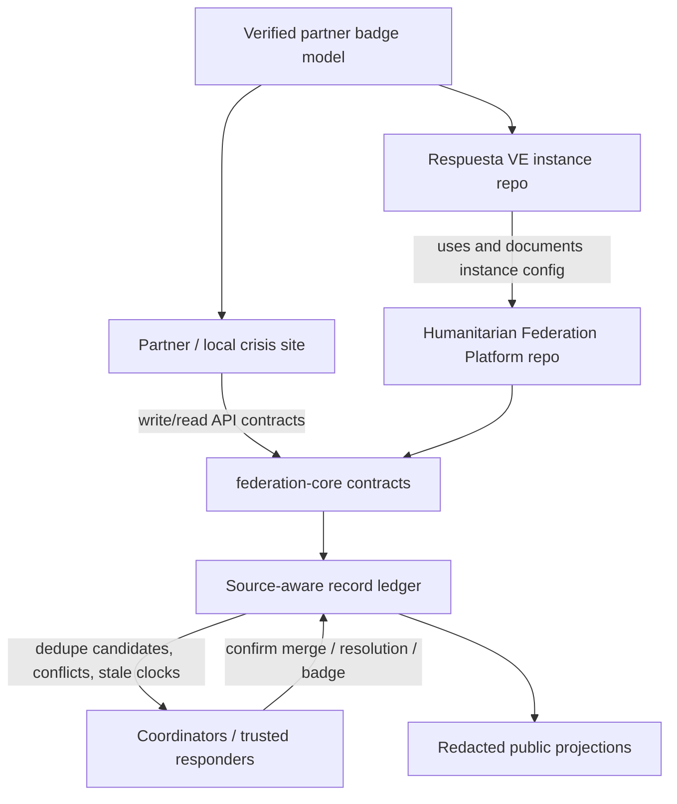
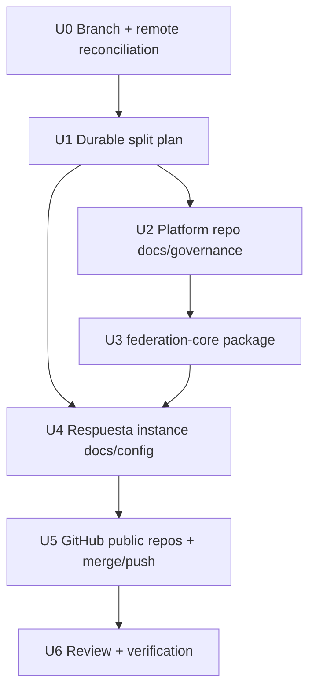

# Public Platform / Venezuela Instance Repo Split

## Problem Frame

Respuesta VE has grown from a Venezuela-earthquake PWA into the first live
instance of a broader humanitarian federation idea: many independent surfaces
should be able to read and write crisis records without duplicating people,
propagating stale statuses, or exposing unsafe data. The current repo should
stay the Venezuela-specific public site. A second public repo should own the
generic platform contract, reusable federation primitives, partner trust model,
badge guidance, and contribution/governance docs.

Current branch state matters: the checkout is on
`codex/federated-entity-trust`, not `main`, and it has one local commit ahead
of `origin/main`. This plan makes that reconciliation part of the work so the
public default branch reflects all accepted changes before the repo split is
declared complete.

## Requirements Trace

- **R1 - Two public repositories:** keep `Emuthmartinez/respuesta-ve` as the
  public Venezuela instance and create `Emuthmartinez/humanitarian-federation-platform`
  as the public reusable platform repo.
- **R2 - Instance boundary:** update the current site/docs so Respuesta VE is
  described as an instance that uses the platform contracts, not as the only
  canonical implementation.
- **R3 - Platform boundary:** move reusable concepts into the new repo:
  crisis events, source partners, person records, coordination entities,
  public projections, duplicate candidates, status summaries, trust badges,
  and adapter guidance.
- **R4 - Duplicate/stale-record controls:** preserve the existing stance that
  matching surfaces likely duplicates and status conflicts, while irreversible
  merge/resolution remains coordinator-reviewed and source-aware.
- **R5 - Privacy/life-safety controls:** keep public surfaces redacted; no
  precise coordinates, cédulas, private contacts, raw photos, private notes,
  or partner secrets in public responses or public docs.
- **R6 - Partner trust/badges:** define verified partner domains, scopes,
  freshness signals, and badge rules so other sites can safely show they are
  federated without implying government endorsement.
- **R7 - Public contribution readiness:** both repos need `AGENTS.md`,
  `CLAUDE.md`, `CONTRIBUTING.md`, `SECURITY.md`, license, and clear docs for
  humans and agents.
- **R8 - Ship state:** commit, merge to `main`, push all relevant branches and
  repos, and verify build/tests or report precise blockers.

## Context & Research

- Existing repo patterns:
  - `lib/api/*` already contains redaction, matching, entity, status, and Zod
    schemas that should shape the platform package.
  - `app/api/v1/*` exposes partner-facing search, matching, status, entity,
    badge, and OpenAPI routes.
  - `AGENTS.md` requires public reads through `*_public` views, anonymous
    life-safety intake, management tokens, RLS/SECURITY DEFINER writes, and
    no public leakage of precise coordinates/contact/cédula/photo data.
  - `docs/STATUS.md` is stale on migration count and should be corrected from
    `0027` to `0033`.
- Prior workspace memory says to keep platform/control-plane logic separate
  from public site repos and verify remote state repo-by-repo.
- External grounding:
  - OCHA/HDX retired supported HXL services as of 2026-01-31, so HXL should be
    treated as an optional legacy adapter/export pattern, not the platform's
    core schema.
  - OASIS CAP v1.2 remains relevant for all-hazard alert interchange; the
    platform should leave an adapter slot rather than forcing CAP into every
    entity record.
  - PFIF/Google Person Finder remains useful historical prior art for missing
    persons: original repositories remain authoritative, records need source
    traceability, and aggregators decide trust rather than declaring one global
    truth.
  - IASC data-responsibility guidance supports the repo's privacy posture:
    personal and non-personal crisis data must be managed safely, ethically,
    and effectively.

## Key Technical Decisions

| Decision | Choice | Rationale |
|---|---|---|
| Repo ownership | Keep `respuesta-ve`; add `humanitarian-federation-platform` | Avoid breaking live domains/deploys while making the generic platform independently reusable. |
| Initial platform artifact | TypeScript core package plus docs, not a hosted service | The reusable contract can be tested and consumed immediately without coupling the instance deploy to an unfinished platform backend. |
| Record model | Source-aware ledger with public projections | Dedupe, status sync, and stale-record handling need provenance and clocks; public readers only need safe projections. |
| Missing-person merge policy | Advisory matching, coordinator-confirmed merges, reversible splits | Wrong automatic merges can hide a still-missing person. The platform should recommend, not silently collapse, identities. |
| Standards posture | Native canonical JSON schema, adapters for PFIF/CAP/HXL-like exports | Native schema can enforce privacy/trust fields; adapters keep interoperability without inheriting outdated or over-specific models. |
| Badge semantics | Verified partner + scopes + freshness, not endorsement | Sites can show federation participation without claiming official state validation. |

## High-Level Technical Design

The platform package should expose deterministic helpers only: validation,
normalization, redaction, status summarization, duplicate scoring, trust/badge
scoring, and public projection builders. Storage, RLS, Supabase RPCs, and UI
remain instance responsibilities until a dedicated platform backend is
designed and deployed.

## Implementation Units

- [x] **U0 - Reconcile current branch before split**
  - **Goal:** make the current accepted work visible to the public default
    branch without losing the local `b6d8188` ingest commit.
  - **Files:** no edits expected; git refs and remote state only.
  - **Approach:** verify the local commit with script syntax checks, then merge
    the feature branch into `main` after implementation/review, preserving the
    conventional history already present.
  - **Verification:** `git status --short --branch`, `git log --oneline`,
    script syntax checks for `.claude/skills/respuesta-ingest/scripts/*.mjs`.

- [x] **U1 - Write this durable plan**
  - **Goal:** create a repo-tracked plan that defines the split and platform
    design before implementation.
  - **Files:** `docs/plans/2026-06-26-002-feat-public-platform-instance-split-plan.md`.
  - **Approach:** deep plan because work spans repositories, public governance,
    architecture, APIs, and safety constraints.
  - **Verification:** plan exists under `docs/plans` and covers all user-stated
    requirements.

- [x] **U2 - Create the public platform repo scaffold**
  - **Goal:** create `humanitarian-federation-platform` with public-ready
    governance, architecture, and contribution docs.
  - **Files:** new repo files:
    `README.md`, `AGENTS.md`, `CLAUDE.md`, `CONTRIBUTING.md`,
    `CODE_OF_CONDUCT.md`, `SECURITY.md`, `LICENSE`, `.gitignore`,
    `docs/ARCHITECTURE.md`, `docs/API_CONTRACT.md`, `docs/DATA_MODEL.md`,
    `docs/TRUST_MODEL.md`, `docs/PRIVACY_MODEL.md`,
    `docs/INSTANCE_GUIDE.md`, `docs/OPERATIONS.md`, `docs/ADAPTERS.md`,
    `docs/ROADMAP.md`, `examples/respuesta-ve/README.md`.
  - **Approach:** platform docs describe any-disaster federation, with
    Venezuela earthquakes as the first instance and proof case.
  - **Verification:** docs name the platform boundary, current first instance,
    contribution process, security reporting, and privacy non-negotiables.

- [x] **U3 - Implement `packages/federation-core` in the platform repo**
  - **Goal:** ship reusable, tested federation primitives that other surfaces
    can import or copy while the hosted platform service matures.
  - **Files:** new repo files:
    `package.json`, `pnpm-workspace.yaml`, `tsconfig.base.json`,
    `packages/federation-core/package.json`,
    `packages/federation-core/tsconfig.json`,
    `packages/federation-core/src/index.ts`,
    `packages/federation-core/src/schemas.ts`,
    `packages/federation-core/src/redaction.ts`,
    `packages/federation-core/src/matching.ts`,
    `packages/federation-core/src/status.ts`,
    `packages/federation-core/src/trust.ts`,
    `packages/federation-core/test/federation-core.test.mjs`.
  - **Approach:** mirror proven ideas from `lib/api/*` and
    `lib/missing-persons.ts`, but generalize names from Venezuela-specific
    fields to crisis/event/source/entity concepts.
  - **Test scenarios:** schema rejects oversized/unknown private fields;
    redaction drops private coordinates/contact/cédula/photo hashes; matching
    confirms same strong IDs and refuses conflicting IDs; status summary flags
    another source resolving an open local record; badge trust requires domain
    verification and freshness.
  - **Verification:** `pnpm install`, `pnpm --filter @humanitarian-federation/core build`,
    and `pnpm --filter @humanitarian-federation/core test` pass in the platform repo.

- [x] **U4 - Convert Respuesta VE docs into an explicit instance**
  - **Goal:** make the current website/repo visibly a Venezuela instance that
    consumes and proves the platform, while leaving runtime behavior intact.
  - **Files:** current repo files:
    `README.md`, `ARCHITECTURE.md`, `AGENTS.md`, `CONTRIBUTING.md`,
    `docs/STATUS.md`, `docs/PLATFORM_INSTANCE.md`,
    `federation.instance.json`, `public/federation.instance.json`,
    `app/desarrolladores/page.tsx`.
  - **Approach:** keep live app code stable; document the repo boundary,
    migration count through `0033`, platform upstream, local instance config,
    and where generic contributions now belong.
  - **Test scenarios:** docs must not expose private live credentials or
    personal operator details; `federation.instance.json` must contain only
    public metadata and domains.
  - **Verification:** current repo `pnpm test:logic`, `npx tsc --noEmit`, and
    `pnpm build` remain green.

- [x] **U5 - Publish repos and merge**
  - **Goal:** finish the requested public split and merge everything.
  - **Files:** git remotes and GitHub repo metadata.
  - **Approach:** create the new GitHub repo as public, push its initial main
    branch, commit current-repo instance docs/plan, merge
    `codex/federated-entity-trust` into `main`, push `main`, and keep the
    feature branch remote current as useful evidence.
  - **Verification:** `gh repo view` shows both repos public; `git ls-remote`
    shows pushed refs; current repo worktree is clean.

- [x] **U6 - Review and browser verification**
  - **Goal:** satisfy LFG's review/test lane before final handoff.
  - **Files:** all changed files.
  - **Approach:** run a code/doc review pass in autofix/headless spirit,
    address confirmed safe findings, run available automated checks, then use
    `ce-test-browser` if `agent-browser` is installed. If browser tooling is
    unavailable, record the blocker and perform a build/runtime smoke check
    instead.
  - **Verification:** review has no blocking residuals, automated checks are
    reported, and browser/runtime verification is either passed or precisely
    blocked.
  - **Result:** automated checks passed; `agent-browser` was not installed, so
    browser automation was blocked and the successful Next build route render
    was used as runtime smoke proof.

## System-Wide Impact

- **Current instance repo:** public users and deploys should see no behavior
  regression. Docs and metadata clarify that Respuesta VE is the first instance
  of a reusable platform.
- **New platform repo:** contributors get a generic entry point without
  inheriting Venezuela-specific operational secrets or live instance coupling.
- **Partner APIs:** existing `/api/v1/*` routes stay live; platform docs explain
  their generalized contract and the future path for non-Venezuela instances.
- **Security posture:** public docs and packages must model redaction and
  advisory dedupe as defaults so partner surfaces do not accidentally publish
  sensitive people/location data.
- **Operational ownership:** each repo has independent issue/contribution
  routing, preventing platform work from cluttering the urgent crisis-instance
  backlog.

## Risks & Mitigations

- **Risk:** accidentally presenting advisory dedupe as authoritative identity
  merge.
  - **Mitigation:** use "candidate", "conflict", "review", and "reversible"
    terminology throughout platform docs and package types.
- **Risk:** platform repo looks like a full hosted backend when it is currently
  contracts plus core primitives.
  - **Mitigation:** README and roadmap explicitly label hosted APIs, sync
    ledger service, and admin UI as future phases.
- **Risk:** public repo docs leak crisis operator details.
  - **Mitigation:** keep instance config public-only and route sensitive details
    to private security reporting.
- **Risk:** HXL is treated as a current mandatory standard.
  - **Mitigation:** docs mark HXL as legacy/optional and favor native JSON with
    adapters.
- **Risk:** merge/push loses the unpushed ingest commit.
  - **Mitigation:** verify branch refs before merging and after pushing.

## Open Questions

### Resolved During Planning

- **Should the current repo be renamed?** No. It already serves live domains
  and is public. Renaming would create avoidable deploy/GitHub disruption.
- **Should the platform be a hosted backend immediately?** No. The first public
  split should ship stable contracts, docs, and tested primitives. A hosted
  multi-tenant service is a later platform phase.
- **Should PFIF/HXL/CAP become the canonical schema?** No. They should be
  adapters/prior art. The native schema must encode the privacy, trust, source,
  and reversible-dedupe semantics this platform needs.

### Deferred To Implementation

- **Exact npm publication path:** keep the package workspace-local in the new
  repo for this pass; decide npm publishing after the repo is public and the
  first import path is proven.
- **Live deployment of a platform backend:** out of scope for this split; track
  in the platform roadmap.

## Verification Plan

- Current repo:
  - `node --check .claude/skills/respuesta-ingest/scripts/*.mjs`
  - `pnpm test:logic`
  - `npx tsc --noEmit`
  - `pnpm build`
- Platform repo:
  - `pnpm install`
  - `pnpm --filter @humanitarian-federation/core build`
  - `pnpm --filter @humanitarian-federation/core test`
- Repo/public state:
  - `gh repo view Emuthmartinez/respuesta-ve`
  - `gh repo view Emuthmartinez/humanitarian-federation-platform`
  - `git status --short --branch`
  - `git ls-remote origin refs/heads/main`
- Browser:
  - `agent-browser` flow via `ce-test-browser` when installed; otherwise
    document missing `agent-browser` and use build/runtime smoke proof.

## Sources & References

- `AGENTS.md`, `README.md`, `ARCHITECTURE.md`, `docs/STATUS.md`
- `lib/api/schemas.ts`, `lib/api/redact.ts`, `lib/api/matching.ts`,
  `lib/api/entities.ts`, `lib/api/status.ts`, `lib/missing-persons.ts`
- OCHA/HDX, "Retiring HXL Services", 2026-01-31 retirement notice.
- OASIS, Common Alerting Protocol v1.2.
- Google Person Finder / PFIF Data API documentation.
- IASC Operational Guidance on Data Responsibility in Humanitarian Action.
